# light weight secured data sharing scheme using mobile computing

&nbsp;&nbsp;&nbsp;&nbsp;&nbsp;&nbsp;&nbsp;&nbsp;&nbsp;&nbsp;&nbsp;&nbsp;&nbsp;&nbsp;&nbsp;&nbsp;&nbsp;&nbsp;&nbsp;&nbsp;&nbsp;&nbsp;&nbsp;&nbsp;
&nbsp;&nbsp;&nbsp;&nbsp;
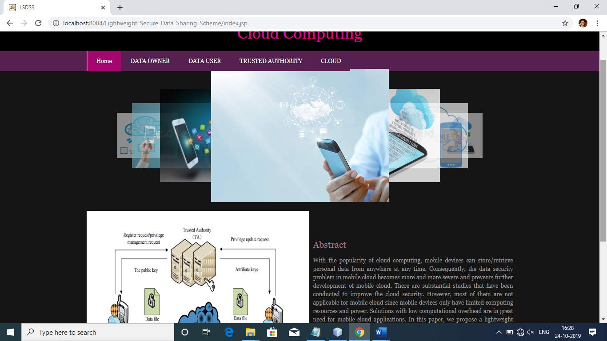
 
 
  
 

# project description

The cloud technology as been improving to secure data and retrieve them at the same time .it is maintaining good privacy setup for stored and retrieve data. There are so many algorithm working under different circumstances. We have to send the data through cloud service provider known as (CSP).
We all know that cloud has resources, and our devices which are related storing and retrieve from cloud has less power consumption. 
We have got different technology related to cloud applications. As normally we can upload and download data from cloud these facility provided by CSP. It has given various options to users. Whether the user wants hide or open the 
content to public his/her wish.by chosen certain options.

# Solution

From past many of the scholars were working on access management in cloud computing related to attribute based encryption algorithm .They came to know that traditional ABE cant work on small computational devices and having limited resource in mobile computing. 
By following previous papers we have design a LDSS technique simple known as Light Weight Data Sharing Scheme to reduce the problem faced by mobile computing on proxy servers and it also helps in protecting the content in cloud. 
The outcome of our design LDSS it is protecting the data and working on smaller computational resources in mobile cloud. The future we will implement to protect the content already existed in cloud . 
Also new design and new algorithm We will introduced in cloud. 

# System Modules

File Encryption and Decryption :
•User encrypted the plain text to encrypted format and	uploaded to the cloud.
•The encryption is done by using a password.
•Only using this password only anyone can decrypt the text.
•The user upload the password also include with encrypted data.
•The trusted authority id responsible for passing the password to the
requested user.

File Request :
•Any user can view the file uploaded in the server.
•All the files are in encrypted format. User cant  view the files without know the password.

•For view the file first user need  to request the password to Trusted Authority.
•The Authority check the user and provide the password for valid user.

View Encrypted Data :
•The user uploaded encrypted data can be view in the server side.
.The trusted authority act as server they have the responsibility to provide password for the requested user.

View user request :
•User view the encrypted data they can request the password for encrypted data.
•This user request can be view in the Trusted authority.

Provide password :
•View the request Trusted authority validating the user and if the user is valid the Trusted authority 
provide password for the requested file via email.
•Using this password user can decrypt the file.

&nbsp;&nbsp;&nbsp;&nbsp;&nbsp;&nbsp;&nbsp;&nbsp;&nbsp;&nbsp;&nbsp;&nbsp;&nbsp;&nbsp;&nbsp;&nbsp;&nbsp;&nbsp;&nbsp;&nbsp;&nbsp;&nbsp;&nbsp;&nbsp;
&nbsp;&nbsp;&nbsp;&nbsp;

# Languages and server used

<b>languages used : </b>java 
<b>tool : </b>Netbeans 
<b>database: </b>Microsoft Apache server 

# Outputs

<b>Data Owner Login</b>   
&nbsp;&nbsp;&nbsp;&nbsp;&nbsp;&nbsp;&nbsp;&nbsp;&nbsp;&nbsp;&nbsp;&nbsp;&nbsp;&nbsp;&nbsp;&nbsp;&nbsp;&nbsp;&nbsp;&nbsp;&nbsp;&nbsp;&nbsp;
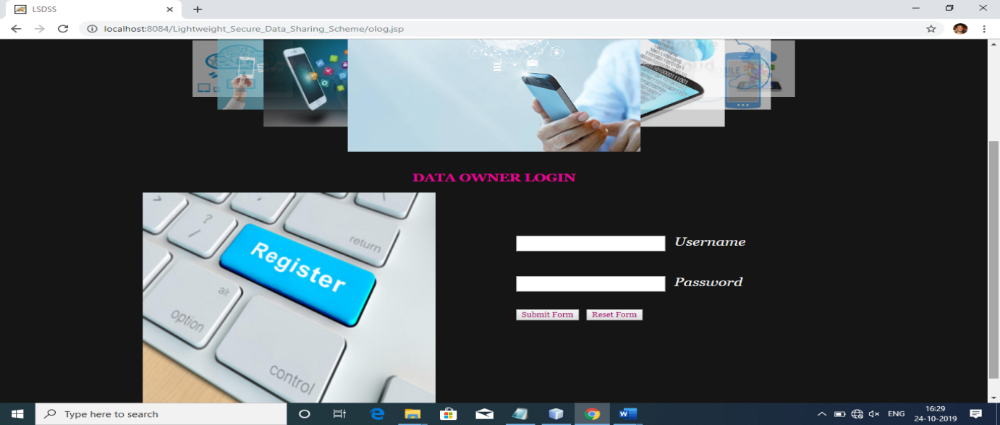
 
<b>Trust Authority</b>   
&nbsp;&nbsp;&nbsp;&nbsp;&nbsp;&nbsp;&nbsp;&nbsp;&nbsp;&nbsp;&nbsp;&nbsp;&nbsp;&nbsp;&nbsp;&nbsp;&nbsp;&nbsp;&nbsp;&nbsp;&nbsp;&nbsp;&nbsp;
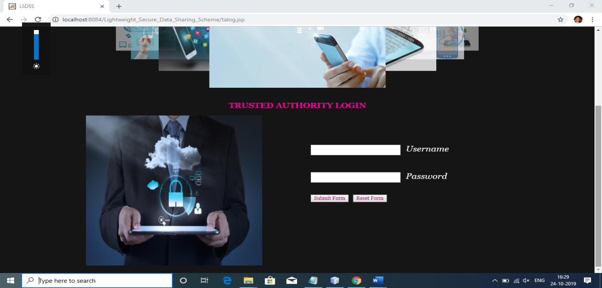
 
<b>Netbeans</b>   
&nbsp;&nbsp;&nbsp;&nbsp;&nbsp;&nbsp;&nbsp;&nbsp;&nbsp;&nbsp;&nbsp;&nbsp;&nbsp;&nbsp;&nbsp;&nbsp;&nbsp;&nbsp;&nbsp;&nbsp;&nbsp;&nbsp;&nbsp;
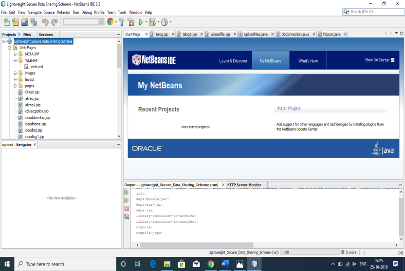
 
<b>Data Owner Home</b>   
&nbsp;&nbsp;&nbsp;&nbsp;&nbsp;&nbsp;&nbsp;&nbsp;&nbsp;&nbsp;&nbsp;&nbsp;&nbsp;&nbsp;&nbsp;&nbsp;&nbsp;&nbsp;&nbsp;&nbsp;&nbsp;&nbsp;&nbsp;
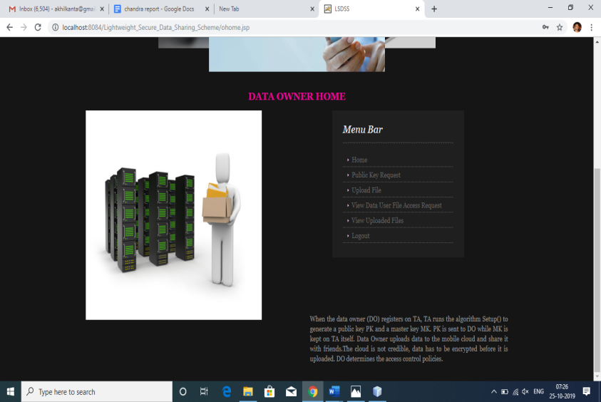
 
<b>Data Owner(Tk)</b>   
&nbsp;&nbsp;&nbsp;&nbsp;&nbsp;&nbsp;&nbsp;&nbsp;&nbsp;&nbsp;&nbsp;&nbsp;&nbsp;&nbsp;&nbsp;&nbsp;&nbsp;&nbsp;&nbsp;&nbsp;&nbsp;&nbsp;&nbsp;
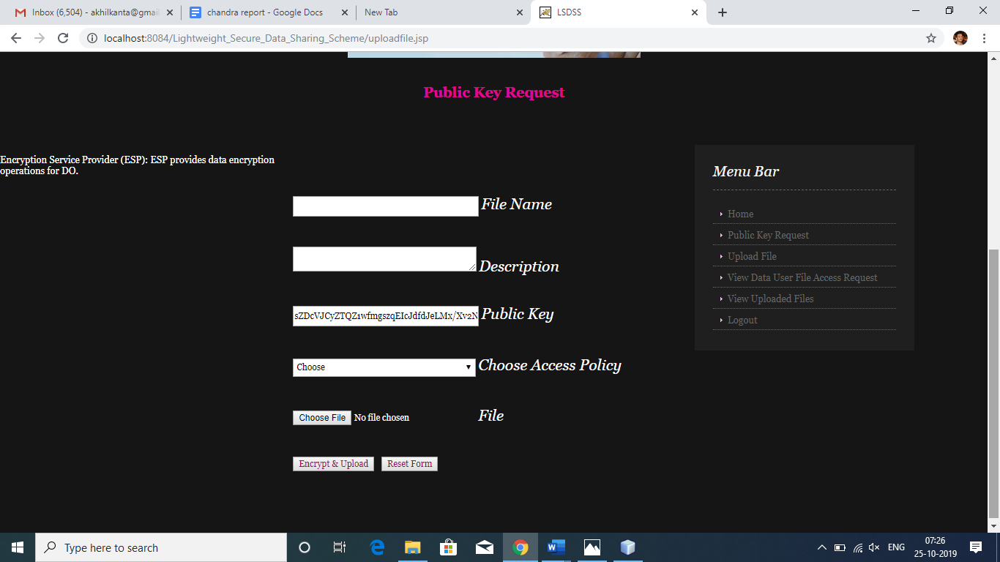
 
<b>Verification</b>   
&nbsp;&nbsp;&nbsp;&nbsp;&nbsp;&nbsp;&nbsp;&nbsp;&nbsp;&nbsp;&nbsp;&nbsp;&nbsp;&nbsp;&nbsp;&nbsp;&nbsp;&nbsp;&nbsp;&nbsp;&nbsp;&nbsp;&nbsp;
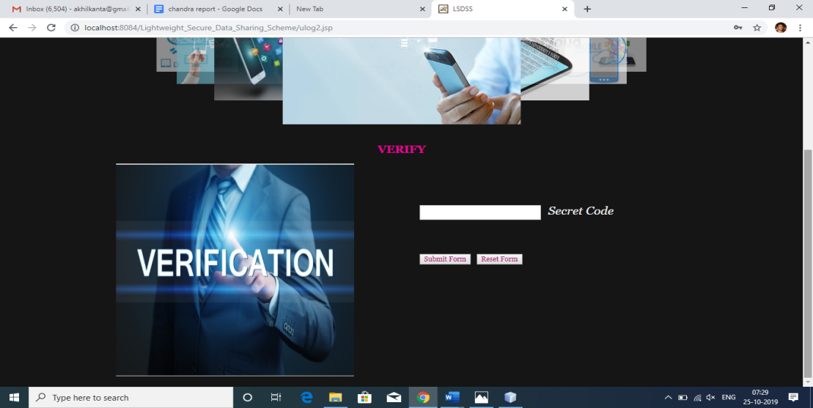
 
<b>Trust Authority Menu</b>   
&nbsp;&nbsp;&nbsp;&nbsp;&nbsp;&nbsp;&nbsp;&nbsp;&nbsp;&nbsp;&nbsp;&nbsp;&nbsp;&nbsp;&nbsp;&nbsp;&nbsp;&nbsp;&nbsp;&nbsp;&nbsp;&nbsp;&nbsp;
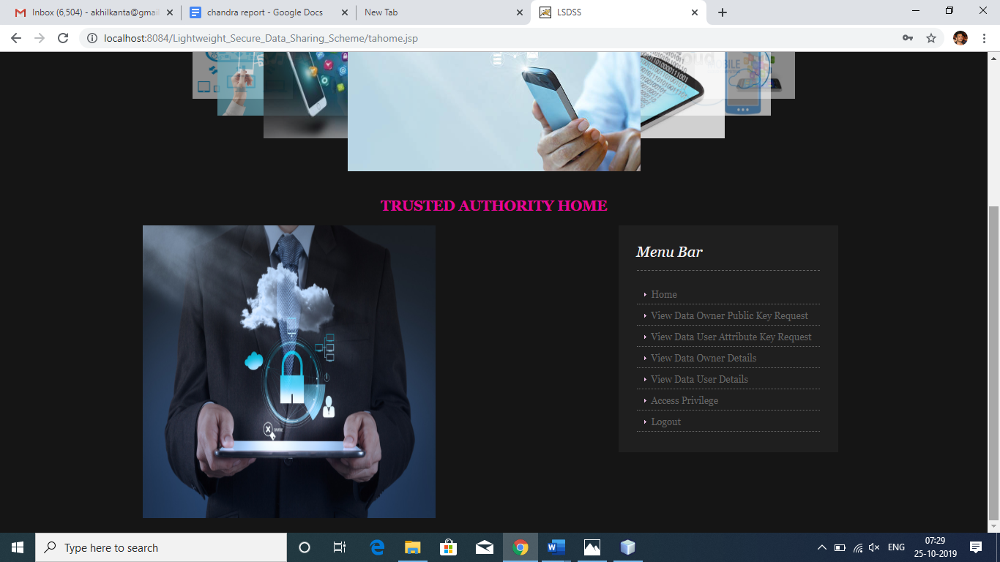
 
<b>Data Owner Details</b>   
&nbsp;&nbsp;&nbsp;&nbsp;&nbsp;&nbsp;&nbsp;&nbsp;&nbsp;&nbsp;&nbsp;&nbsp;&nbsp;&nbsp;&nbsp;&nbsp;&nbsp;&nbsp;&nbsp;&nbsp;&nbsp;&nbsp;&nbsp;
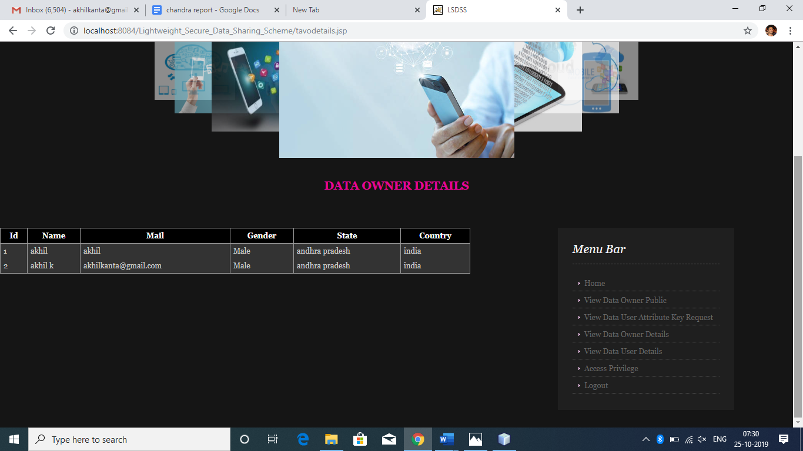
 
<b>Data Access Privilege</b>   
&nbsp;&nbsp;&nbsp;&nbsp;&nbsp;&nbsp;&nbsp;&nbsp;&nbsp;&nbsp;&nbsp;&nbsp;&nbsp;&nbsp;&nbsp;&nbsp;&nbsp;&nbsp;&nbsp;&nbsp;&nbsp;&nbsp;&nbsp;
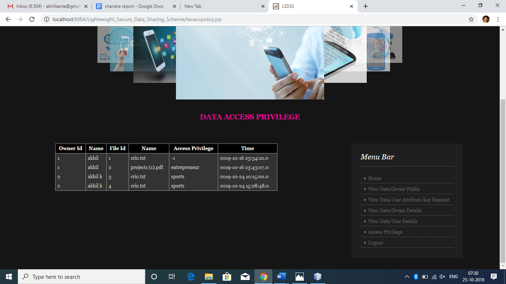
 
<b>Data Access</b>   
&nbsp;&nbsp;&nbsp;&nbsp;&nbsp;&nbsp;&nbsp;&nbsp;&nbsp;&nbsp;&nbsp;&nbsp;&nbsp;&nbsp;&nbsp;&nbsp;&nbsp;&nbsp;&nbsp;&nbsp;&nbsp;&nbsp;&nbsp;
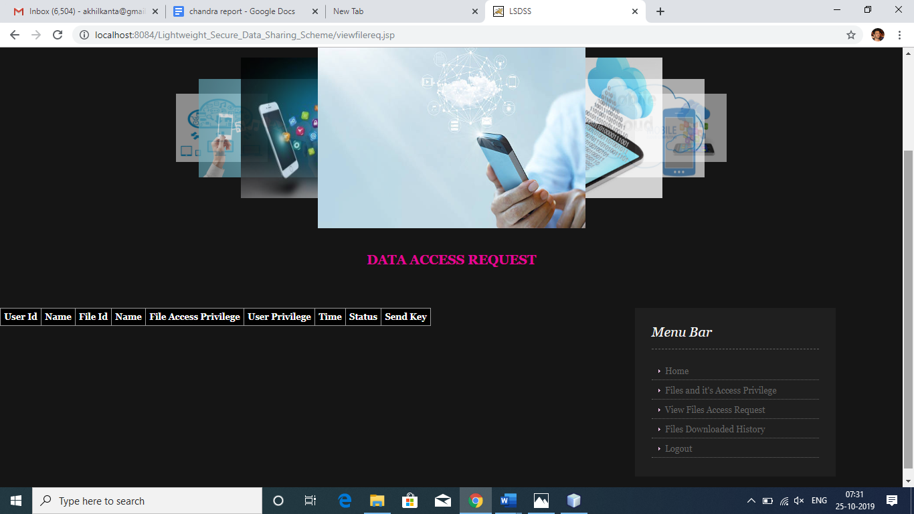
 
<b>File Downloaded History</b>   
&nbsp;&nbsp;&nbsp;&nbsp;&nbsp;&nbsp;&nbsp;&nbsp;&nbsp;&nbsp;&nbsp;&nbsp;&nbsp;&nbsp;&nbsp;&nbsp;&nbsp;&nbsp;&nbsp;&nbsp;&nbsp;&nbsp;&nbsp;
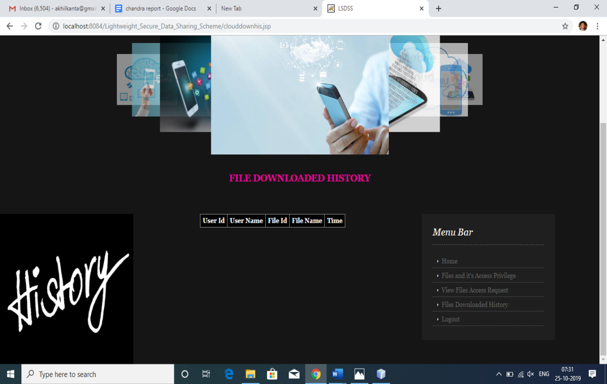
 

# contributor

Project done by  
Kanta Rohit 
D.Sai Narshima Reddy 
Gandla Sai Varun 
Rushivender Jakka 
